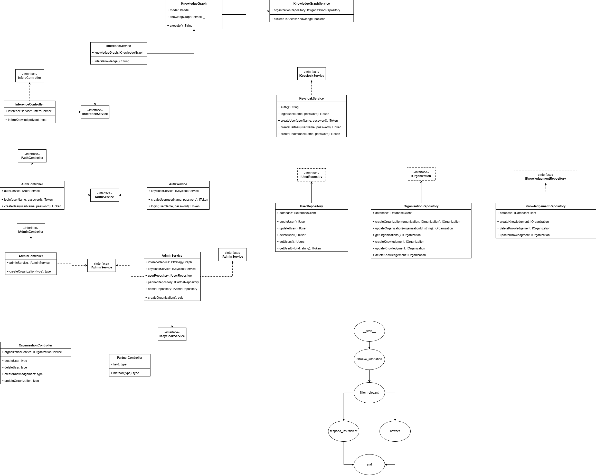

# Knowledge Base API

API de base de conhecimento corporativo multi-tenant. Organizações cadastram documentos de conhecimento; funcionários consultam esses documentos através de um agente de IA (LangGraph + Gemini) que decide se a resposta existe, se é restrita, ou se o conhecimento é insuficiente para responder.

---

## Visão Geral da Arquitetura

```
Cliente (Bruno/curl)
        │
        ▼
  NestJS API (:3000)
        │
        ├─── PostgreSQL       → metadados (organizações, usuários, knowledgements)
        ├─── Keycloak (:8080) → autenticação JWT por realm/organização
        ├─── MinIO (:9000)    → conteúdo dos documentos (S3-compatible)
        └─── Gemini API       → LLM para o agente de inferência
```

### Fluxo de Inferência (LangGraph)

```
Query do usuário
      │
      ▼
RETRIEVE_KNOWLEDGE  ← busca documentos da organização no banco
      │
      ▼
FILTER_RELEVANT     ← LLM filtra quais documentos são relevantes para a query
      │
      ├─ nenhum relevante ──► RESPONSE_INSUFFICIENT
      └─ relevantes ────────► ANSWER  ← LLM gera a resposta com base nos docs do S3
```

---

## Isolamento entre Organizações

**Cada organização é completamente isolada das demais.** O isolamento acontece em duas camadas:

### 1. Autenticação — Keycloak por Realm

Cada organização tem seu próprio **realm** no Keycloak. Um usuário da TechCorp só consegue autenticar no realm `techcorp`; um usuário da FinanceGroup só no realm `financegroup`. O JWT emitido carrega o `iss` (issuer) com o realm de origem, e a API usa isso para identificar a organização do usuário sem precisar que ele informe o ID.

### 2. Dados — Filtro por `organizationId`

Toda consulta ao banco filtra pelo `organizationId` extraído do JWT. Não há nenhuma rota que permita a um usuário acessar dados de outra organização:

- `GET /organizations/:orgId/knowledge` — o controller valida que `orgId === req.user.organizationId`
- O agente de inferência recebe o `organizationId` do token e só busca documentos daquela organização
- Documentos no S3 são armazenados em `organizations/{orgId}/knowledgements/{uuid}.txt`

Um usuário da TechCorp **nunca** vê, acessa ou influencia o conteúdo da FinanceGroup.

---

## Serviços Docker

| Serviço           | Imagem                            | Porta | Função |
|-------------------|-----------------------------------|-------|--------|
| **PostgreSQL**    | `postgres:16`                     | 5432  | Banco principal — organizações, usuários, metadados dos documentos |
| **Keycloak**      | `quay.io/keycloak/keycloak:24.0`  | 8080  | Identity Provider — um realm por organização, JWT RS256 |
| **keycloak-init** | `quay.io/keycloak/keycloak:24.0`  | —     | Job único que cria o realm `admin`, o client `knowledge-api` e o usuário `platform-admin` |
| **MinIO**         | `minio/minio:latest`              | 9000  | Object storage S3-compatible — armazena o conteúdo textual dos documentos |
| **minio-init**    | `minio/mc:latest`                 | —     | Job único que cria o bucket `squadfy-knowledge` |

### Keycloak

O Keycloak roda em modo `start-dev` (banco embutido, sem TLS). É o responsável por:
- Emitir tokens JWT assinados com RSA (RS256)
- Validar credenciais de usuário por realm
- Expor o JWKS (`/realms/{realm}/protocol/openid-connect/certs`) para a API verificar assinaturas

Console de administração: [http://localhost:8080](http://localhost:8080) — usuário `admin`, senha `admin`.

### MinIO

MinIO é um clone local do AWS S3. O conteúdo dos documentos de conhecimento é armazenado como arquivos `.txt` no bucket `squadfy-knowledge`. A API usa o SDK `@aws-sdk/client-s3` apontando para `http://localhost:9000`.

Console web: [http://localhost:9001](http://localhost:9001) — usuário `minioadmin`, senha `minioadmin`.

---

## Pré-requisitos

- Node.js 20+
- Docker + Docker Compose
- Conta no [Google AI Studio](https://aistudio.google.com/) com uma `GOOGLE_API_KEY` (Gemini gratuito funciona)

---

## Passo a Passo — Ambiente de Desenvolvimento

### 1. Clone e instale dependências

```bash
git clone <repo-url>
cd squadfy_challenge
npm install
```

### 2. Configure as variáveis de ambiente

```bash
cp .env.example .env
```

Edite o `.env` e coloque sua `GOOGLE_API_KEY`:

```env
GOOGLE_API_KEY=sua-chave-aqui
```

As demais variáveis já estão corretas para rodar localmente com Docker.

### 3. Suba os serviços Docker

```bash
docker compose up -d
```

Aguarde todos os serviços ficarem saudáveis (~30-60s na primeira vez). Você pode acompanhar os jobs de inicialização:

```bash
docker compose logs -f keycloak-init   # pronto quando aparecer "Realm: admin"
docker compose logs -f minio-init      # pronto quando aparecer "Bucket ready."
```

### 4. Rode as migrações do banco

```bash
npm run db:migrate
```

Isso cria as tabelas `organizations`, `users` e `knowledgements` (com índice FTS no PostgreSQL).

### 5. Popule o banco com dados de seed

```bash
npm run db:seed
```

O seed cria:
- Organização **Platform Admin** (realm: `admin`) — usuário `platform-admin` com role `ADMIN`
- Organização **TechCorp** (realm: `techcorp`) — `tc-manager` (ORGANIZATION), `tc-user1` (USER)
- Organização **FinanceGroup** (realm: `financegroup`) — `fg-user1` (USER)
- Documentos de conhecimento para cada organização (conteúdo enviado ao MinIO)

As credenciais e IDs gerados são salvos em `seed-output.json`.

### 6. Inicie a API

```bash
npm run start:dev
```

A API estará disponível em [http://localhost:3000/api/v1](http://localhost:3000/api/v1).

---

## Testando com Bruno

Instale o [Bruno](https://www.usebruno.com/), abra a pasta `bruno/` como coleção e selecione o environment **local**.

**Ordem obrigatória — execute os logins antes de qualquer rota protegida:**

1. `auth/Login as Platform Admin` → popula `{{admin_token}}`
2. `auth/Login as Org Manager` → popula `{{org_token}}`
3. `auth/Login as User` → popula `{{user_token}}`

Em seguida explore as demais rotas normalmente.

---

## Endpoints da API

| Método   | Rota                                      | Role                      | Descrição |
|----------|-------------------------------------------|---------------------------|-----------|
| `POST`   | `/auth/login`                             | público                   | Login — retorna JWT |
| `POST`   | `/admin/organizations`                    | ADMIN                     | Cria organização + realm Keycloak |
| `POST`   | `/admin/users`                            | ADMIN, ORGANIZATION       | Cria usuário em uma organização |
| `GET`    | `/admin/organizations`                    | ADMIN                     | Lista todas as organizações |
| `POST`   | `/organizations/:orgId/knowledge`         | ORGANIZATION              | Cadastra documento (conteúdo vai pro S3) |
| `GET`    | `/organizations/:orgId/knowledge`         | ORGANIZATION, ADMIN       | Lista documentos (apenas metadados) |
| `DELETE` | `/organizations/:orgId/knowledge/:id`     | ORGANIZATION              | Remove documento |
| `GET`    | `/organizations/:orgId/users`             | ORGANIZATION, ADMIN       | Lista usuários da organização |
| `DELETE` | `/organizations/:orgId/users/:userId`     | ADMIN                     | Remove usuário |
| `POST`   | `/inference/query`                        | USER, ORGANIZATION, ADMIN | Consulta ao agente de IA |

---

## Scripts disponíveis

```bash
npm run start:dev    # servidor em modo watch (reinicia ao salvar)
npm run build        # compila TypeScript para /dist
npm run test         # testes unitários
npm run db:migrate   # executa migrações Drizzle ORM
npm run db:seed      # popula banco + Keycloak + MinIO com dados iniciais
```

---

## Tecnologias

- **NestJS** — framework HTTP com injeção de dependência
- **Drizzle ORM** + **PostgreSQL 16** — banco de dados com FTS nativo (`tsvector`)
- **Keycloak 24** — autenticação multi-realm (um realm por organização)
- **MinIO** — object storage S3-compatible para conteúdo dos documentos
- **LangGraph** (`@langchain/langgraph`) — orquestração do agente de IA em grafo
- **Google Gemini** (`gemini-2.5-flash`) — LLM para filtragem e geração de respostas
- **Bruno** — coleção de requests para testar a API

## Class Diagram
Abaixo segue diagrama de classe que foi utilizado como base para criar o relacionamento entre as entidades do sistema.
</br>


## Ressalvas
Houveram funcionalidade que foram retiradas/não implementadas devido ao tempo para envio do projeto, abaixo segue algumas melhorias e sugestões que poderiam enriquecer e melhorar a qualidade do software


### Redis (cache aside pattern)
Se considerarmos que existiriam diversos funcionarios de uma organização realizando perguntas parecedias para o LLM, então poderiamos cachear esse valor pra que não fosse necessário realizar chamadas ao banco de dados + s3 toda vez que uma pergunta fosse feita.

### Fallback model
Como temos uma forte dependencia em um modelo de LLM para realizar o RAG seria interessante implementar um fallback caso o provedor da LLM ficasse indisponivel ou houvesese alguma falha com a comunicação do mesmo.

### Strategias para otimização de tokens
Como as perguntas são feitas em linguagem natural poderia ser implementado uma biblioteca (ex: caveman) para diminuir a quantidade de tokens de entrada, assim diminuindo o custo para a LLM plugada no código.